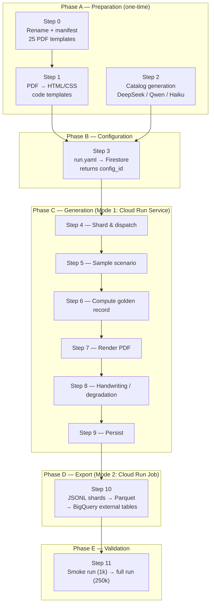
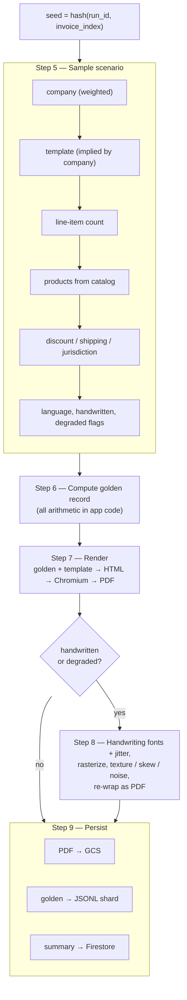
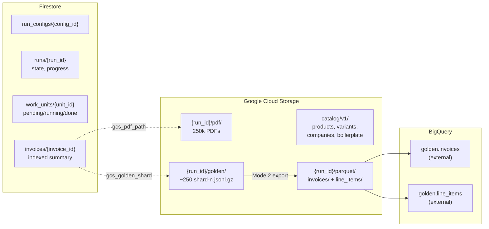
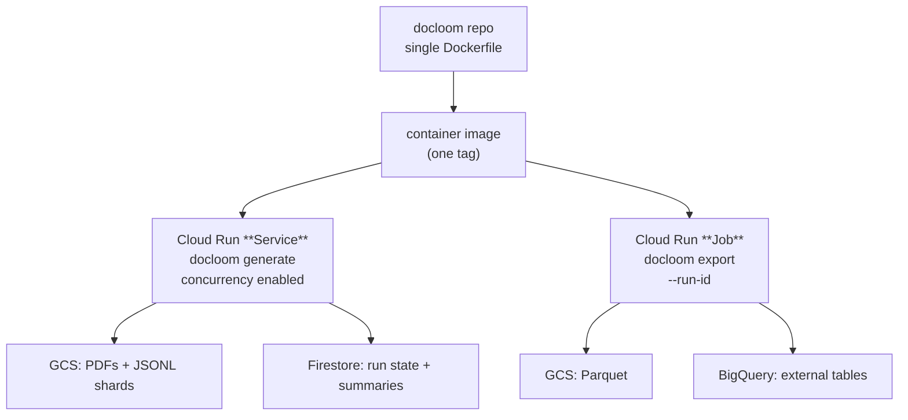
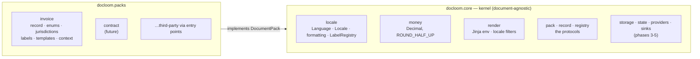
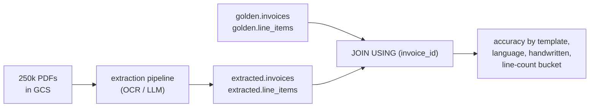

# docloom — Design & Execution Plan

Weave templates and generated data into realistic documents, alongside a computed
golden dataset you can score an extraction pipeline against.

The first document type is **invoices** — 250k of them, for testing an OCR/LLM
extraction pipeline. The architecture is deliberately not invoice-shaped: a
document-agnostic **kernel** does the weaving, and a **pack** supplies one
document type's record shape, templates, and vocabulary. Contracts, delivery
notes, and legal filings are additional packs, not forks.

---

## Contents

- [System overview](#system-overview)
- [Phase A — Preparation](#phase-a--preparation-one-time-before-any-run)
- [Phase B — Run configuration](#phase-b--run-configuration)
- [Phase C — Generation (Mode 1)](#phase-c--generation-mode-1-cloud-run-service)
- [Phase D — Export (Mode 2)](#phase-d--export-mode-2-cloud-run-job)
- [Phase E — Validation](#phase-e--validation)
- [Storage & data model](#storage--data-model)
- [Deployment topology](#deployment-topology)
- [Evaluation workflow](#evaluation-workflow)
- [Design decisions](#design-decisions)
- [Budget](#budget)

---

## System overview



---

## Phase A — Preparation (one-time, before any run)

### Step 0 — Rename and catalogue the templates ✅ done

39 source PDFs, renamed to **neutral structural slugs** and recorded in
`templates/manifest.yaml`.

Slugs describe *layout*, never industry. The source PDFs happen to depict law firms,
storage companies, and book publishers, but templates supply structure only — any
archetype may render any company type. Encoding a vertical in the name would assert a
coupling that does not exist and would artificially constrain which companies can use
which layout.

```
meta-sidebar-01.pdf        layout-splitcol-08.pdf     tax-multi-30.pdf
meta-rightrail-03.pdf      totals-fullwidth-05.pdf    telecom-itemized-37.pdf
cols-partno-24.pdf         table-boxed-14.pdf         frca-full-38.pdf
```

Families: `meta-*` (metadata-block placement), `layout-*` (page division), `totals-*`
(totals presentation), `table-*` (table styling), `cols-*` (column set), `tax-*` /
`ca-*` (tax exemplars), `receipt-*` (short consumer receipts), `frca-*` (Quebec French),
`telecom-*` (the high-line-count archetype).

The manifest records `src_*` fields (the PDF as-found) separately from `code_layer`
(what conversion must add), so the two are never confused.

**Corpus coverage:** en + fr-CA; US, CA-ON, CA-QC; USD + CAD; 14 templates with a tax
row, 3 with a discount, 2 with shipping, 3 multi-page. No fr-FR, GBP, or EUR exemplar —
those are code-layer only.

**`telecom-itemized-37` is the standout**: 23 pages, 895 amount rows, running page
headers, a four-level hierarchy (account → subscriber → category → event), `(cont'd)`
section continuation across page breaks, and negative line items. It is the only source
for the 2,000–8,000 line-item requirement and the hardest extraction case in the dataset.

### Step 1 — Convert each template to a code template

Each PDF becomes an HTML/CSS template reproducing its layout: header, logo slot,
address blocks, line-item table, totals stack, footer.

Each template declares its own **variation slots**:

- Column header vocabulary — `Item` / `Product` / `Description` / `Article` / `Désignation`
- Date and currency format
- Tax label — `Sales Tax` / `GST+PST` / `VAT` / `TVA`
- Discount placement — inline column or separate summary row

Done once, human-reviewed. This is the one place an LLM meaningfully assists, and it
sits outside the $50 budget — it is interactive work, not batch generation.

### Step 2 — Generate the content catalog

One batch job, mixed across three models, versioned into GCS.

| Asset | Volume | Output tokens | Cost |
|---|---|---|---|
| Product catalog @ 300 tok descriptions | 50k | 15.0M | $19.50 |
| Description variants (3 phrasings per SKU) | 20k × 3 | 4.8M | $6.25 |
| French product descriptions (native) | 8k | 2.4M | $3.10 |
| Notes / PO refs / delivery memos | 5k | 0.3M | $0.40 |
| Company identities | 106 | 0.09M | $0.12 |
| T&C / payment-terms boilerplate | 40 | 0.02M | $0.03 |
| | | **Subtotal** | **~$29** |

**Model split:** 40% DeepSeek V4-Flash / 40% Qwen3.5-Flash / 20% Claude Haiku 4.5.
Blended rate ≈ $1.30 per 1M output tokens.

**Batch the Haiku slice** — the Batches API is 50% off and this workload is offline
and latency-insensitive.

**Prompt caching note:** Haiku 4.5's minimum cacheable prefix is 4,096 tokens. A short
system prompt will silently fail to cache (`cache_creation_input_tokens: 0`, no error).
Either accept full price or pad the prefix past 4,096 tokens with genuinely useful
content — few-shot examples, per-vertical SKU conventions, a style guide.

Version the output at `gs://<bucket>/catalog/v1/` and **do not regenerate casually** —
this is the only irreversible AI spend, and regenerating invalidates reproducibility
against golden data from prior runs.

---

## Phase B — Run configuration

### Step 3 — YAML config → Firestore

The run YAML declares:

| Parameter | Example |
|---|---|
| `total_invoices` | 250000 |
| `company_weights` | anchor: 50000; fr_a..fr_e: 1000 each; 100 others: remainder |
| `handwritten_count` | 1000 |
| `degradation_rate` | 0.08 |
| `line_item_distribution` | median 8, heavy tail; telecom archetype 2000–8000 |
| `max_line_items` | 8000 (hard cap) |
| `template_allowlist` | slugs from `manifest.yaml` |
| `catalog_version` | `v1` |

The deploy script copies it to Firestore and returns a `config_id`. Generation is
launched with:

```
docloom generate --config-id=<id> --action=start|resume|pause|cancel
```

`max_line_items` is a hard cap, not a hint. If the heavy-tail distribution is
misparameterized and draws 50,000 line items, that should surface as a config
validation error — not a Cloud Run timeout.

---

## Phase C — Generation (Mode 1, Cloud Run Service)



### Step 4 — Shard and dispatch

The run divides into work units of ~1,000 invoices. Each unit is a task; the service
processes tasks concurrently. Unit state (`pending` / `running` / `done`) lives in
Firestore — this is what makes pause / resume / cancel work at unit granularity rather
than per invoice.

### Step 5 — Sample the scenario

Seed a PRNG from `hash(run_id, invoice_index)`. Every downstream draw derives from that
seed, so the entire scenario is a pure function of `(run_id, index)`.

### Step 6 — Compute the golden record

All arithmetic in application code — never in an LLM:

- Line extensions
- Discount application order (varying pre-tax vs post-tax; the order matters and should
  differ across invoices)
- Subtotal, shipping, per-bucket tax, grand total
- Round-half-up at documented precision

This object **is** ground truth. The PDF is a rendering of it.

### Step 7 — Render to PDF

Golden record + template → HTML → headless Chromium → PDF.

- Keep one warm browser process per instance; process spawn otherwise dominates cost
- Budget ~50–200 ms for a normal invoice, seconds for the large ones
- Route invoices above a line-count threshold to a **separate queue** so they do not
  stall normal batches

### Step 8 — Handwritten and degraded variants

Handwriting is not an LLM task. Re-render the same HTML with handwriting webfonts
(several, varied by company) plus CSS per-character jitter in rotation, baseline, and
spacing. Then rasterize and post-process:

- Paper texture
- 0.3–2° skew
- Gaussian blur
- Sensor noise
- JPEG artifacts
- Occasional coffee ring or staple shadow

Re-wrap the image as a PDF. A **lighter version of the same degradation** applies to a
configurable slice of otherwise-clean invoices — a pipeline that only ever sees crisp
digital PDFs is not being tested.

### Step 9 — Persist

Three writes per work unit:

| Artifact | Destination |
|---|---|
| PDF | `gs://<bucket>/{run_id}/pdf/{shard}/{invoice_id}.pdf` |
| Golden records | `gs://<bucket>/{run_id}/golden/shard-{n}.jsonl.gz` |
| Summary | Firestore, one doc per invoice, keyed by `invoice_id` |

Doc-ID-as-key makes retries idempotent. Firestore batch writes cap at 500 per batch.

---

## Phase D — Export (Mode 2, Cloud Run Job)

### Step 10 — Parquet + BigQuery

```
docloom export --run-id=<id>
```

Reads the ~250 JSONL shards and writes two Parquet datasets, then registers BigQuery
external tables over them. Idempotent and re-runnable — safe to delete the Parquet and
regenerate at any time.

---

## Storage & data model



### Two flat tables, not one nested

**`invoices`** — one row per invoice, ~250k rows, a few MB:

`invoice_id`, `run_id`, `company_id`, `template_id`, `country`, `language`,
`currency`, `issue_date`, `subtotal`, `discount_total`, `shipping_total`,
`tax_total`, `grand_total`, `line_item_count`, `is_handwritten`, `is_degraded`,
`gcs_pdf_path`

**`line_items`** — one row per line item, ~12M rows, 300–600 MB compressed:

`invoice_id` (FK), `line_no`, `sku`, `part_number`, `description`, `quantity`,
`unit_price`, `discount_pct`, `extended_amount`, `tax_rate`

---

## Deployment topology



| | Mode 1 — generate | Mode 2 — export |
|---|---|---|
| Primitive | **Service** | **Job** |
| Why | Long-lived, concurrent, pausable mid-run | Finite, parameterized, run-to-completion |
| Gets for free | Autoscaling, request concurrency | Task-index sharding, retries, exit codes, no HTTP surface |

Same image for both; entrypoint dispatches on `argv[1]`. The deploy script takes a
`--mode` flag and calls either `gcloud run deploy` or `gcloud run jobs deploy`.

### Architecture — kernel and packs



**Two protocols carry the whole design.**

`GoldenRecord` requires `record_id`, `run_id`, `locale`, and `to_rows()`. An invoice
returns `{"invoices": [...], "line_items": [...]}`; a contract would return
`{"contracts": [...], "clauses": [...]}`. The exporter never learns which.

`DocumentPack` requires `name`, `template_root`, `labels`, `table_names`,
`build_context()`, and `archetype_for()`. Deliberately tiny — a pack interface
designed against one document type will be wrong somewhere, and the cheapest way to
absorb that is narrow kernel expectations and wide pack latitude.

Packs register through the `docloom.packs` entry-point group, the same mechanism
third parties use, so `pip install docloom-contract` works with no change to docloom.

### Repository layout

Python 3.12. Package layout:

```
docloom/
  DESIGN.md
  pyproject.toml
  .env.example              # copy to .env; all keys and run params
  .gitignore                # excludes .env AND templates/*.pdf (personal data)
  Dockerfile
  deploy.sh                 # --mode=generate|export
  src/docloom/
    schema/                 # ✅ golden record — the shared contract
      enums.py              #    closed vocabularies (Parquet column values)
      money.py              #    Decimal arithmetic, ROUND_HALF_UP
      invoice.py            #    GoldenInvoice + flattening to the two tables
    i18n/                   # ✅ localisation
      jurisdictions.py      #    tax models: US, CA-ON/QC/BC/AB, GB, FR
      labels.py             #    en / fr-CA / fr-FR dictionaries + column vocabs
      formatting.py         #    currency, date, rate, quantity per locale
    catalog/                # LLM catalogue generation (DeepSeek/Qwen/Haiku)
    logos/                  # SVG wordmarks + FLUX abstract marks
    generate/               # sampling, rendering, GCS + Firestore writes
    export/                 # JSONL shards -> Parquet -> BQ external tables
    cli.py                  # docloom generate | export
  templates/
    manifest.yaml           # ✅ 39 templates, structural slugs
    *.pdf                   # ⚠ personal data — gitignored, deleted after Step 1
    html/                   # archetypes + variation matrix
  config/
    run-*.yaml
```

`src/schema/` imported by both `generate/` and `export/` is the point of the single
repo — the writer and reader of the golden record cannot drift apart.

---

## Phase E — Validation

### Step 11 — Smoke run, then full run

1,000 invoices first, stratified to cover:

- Every template
- Both languages
- All four jurisdictions
- At least one 5,000-line invoice
- Several handwritten and several degraded

Re-extract and assert against golden. **Only then** launch the full 250k. A template bug
discovered at invoice 200,000 costs the entire render spend a second time.

Ongoing: validate a random 0.5% of every full run.

---

## Evaluation workflow



A full evaluation is one query:

```sql
SELECT i.template_id, i.language, i.is_handwritten,
       COUNTIF(e.grand_total = i.grand_total) / COUNT(*) AS total_accuracy
FROM golden.invoices i JOIN extracted.invoices e USING (invoice_id)
WHERE i.run_id = @run_id
GROUP BY 1, 2, 3
```

Line-item recall and precision come from the equivalent join on `line_items`.

---

## Design decisions

**Golden data is computed, never extracted.** The truth object is the *input* to
rendering, not something recovered from the PDF afterward. Deriving truth from generated
output would reintroduce exactly the extraction error the pipeline is meant to be tested
against.

**Templates become code, not overlays.** Stamping text onto fixed-layout PDFs breaks the
moment line counts vary, and pagination is the entire point of the call-center case.
HTML → Chromium handles multi-page tables, repeating headers, and page N-of-M natively.

**Deterministic seeding.** `hash(run_id, invoice_index)` makes the run reproducible and
resume trivial — a restarted worker regenerates byte-identical output for the same
index, so retries are inherently idempotent.

**Golden records in GCS, not Firestore.** Firestore's 1 MiB document limit makes an
8,000-line-item invoice unstorable as a document, and line items as subcollection docs
would mean ~12M writes. Firestore holds the indexed summary; GCS holds the truth. This
is a correctness constraint, not a cost one — it stands regardless of credits.

**JSONL shards during generation, Parquet at export.** Writing 250k individual JSON
objects would make the export job perform 250k GETs. One shard per work unit still
satisfies "written alongside the invoices as they are generated" while making export a
minutes-long job instead of an hours-long one.

**Two flat tables, not one nested.** Line-item matching is the hard part of invoice
extraction — did it find all 8,000 rows with correct quantities? A flat `line_items`
table computes per-line recall and precision directly in SQL. Nested arrays force
`UNNEST` into every query.

**BigQuery external tables.** The extraction output lands in a table with the same shape;
evaluation becomes a single JOIN producing accuracy sliced by template, language,
handwritten-vs-clean, and line-count bucket. No Python data plumbing, no storage
duplication.

**One image, two Cloud Run primitives.** A Service for generation (concurrent,
long-lived, pausable) and a Job for export (finite, parameterized, run-to-completion).
Shared `src/schema/` imported by both is the point of the single repo.

**Three models, mixed.** Not a cost decision — a single-model catalog has a uniform voice
an extraction pipeline can learn. The 20% Haiku slice is 79% of blended cost and worth it
for lexical diversity.

**Description variants over more rows.** Real ERP systems emit the same SKU
inconsistently — truncated, ALL CAPS, part number inline or in a separate column. 50k
rich products with 3 phrasings each is a harder and more realistic test than 100k thin
ones.

**Native French, not translated.** French commercial invoice copy has its own conventions
(*référence*, *désignation*, *conditionnement*) that translated English copy will not
reproduce.

**Degrade some clean invoices too.** Scan artifacts are not exclusive to handwritten
documents. A configurable slice of printed invoices gets light degradation so the
pipeline is tested on realistic capture quality, not just realistic content.

**Templates are structural, not sectoral.** A layout carries no information about what
kind of business issued it. Decoupling the two multiplies usable diversity — 39
structures × any company — and avoids baking a false correlation into the dataset.

**fr-CA and fr-FR are separate locales, split 50/50.** Not dialects of one another.
They differ in tax system (TPS/TVQ vs TVA), discount wording (Rabais vs Remise),
currency and its placement ($ after vs € after), date form (`15 juillet 2026` vs
`15/07/2026`), and — structurally — in the totals block: France states Total HT → TVA →
Total TTC, Quebec states Sous-total → taxes → Total général. France additionally
mandates SIRET, TVA intracommunautaire, and a late-payment penalty notice. Two
dictionaries, two jurisdiction profiles, no shared fallback.

**Label dictionaries are hand-authored, not generated.** ~60 terms per language, a
closed set where correctness matters more than variety. A mistranslated tax label would
be indistinguishable from an extraction failure during evaluation. The LLM generates
product descriptions and company identities — content, not chrome.

**Money is `Decimal`, never `float`.** A subtotal that disagrees with the rendered PDF
by one cent is indistinguishable from a genuine extraction error. Rounding is
ROUND_HALF_UP applied at each *printed* value, matching what accounting systems do.
`InvoiceTotals` and `GoldenInvoice` carry validators that reject a record which does not
reconcile — a golden record that does not balance is worse than none, because it would
score a correct extraction as wrong.

**Business type is decoupled from template, and drives billing model.** 37 business
types spanning goods, trades, health, professional services, technology, financial
services, logistics, and consumer subscriptions. Each draws from its own item pool and
its own set of billing models, so a B2B SaaS invoice mixes recurring subscription, seat
overage, and one-time fees, while an auto-repair invoice splits hourly labour from parts
carrying MPNs. None of this is visible in the layout, which stays independent.

**Graduated and volume tiering are modelled separately.** Graduated prices each band's
units at that band's rate; volume prices the whole quantity at the reached band's rate.
Identical inputs, different totals — 150,000 API calls costs $205.00 graduated and
$150.00 volume. That difference is a sharp test of whether an extractor parsed the tier
table or just read the bottom line.

**Tier bands are printed rows, so they are golden rows.** A tiered line emits a parent
row plus one row per band, with `parent_line_no` and `tier_index` set. Golden rows map
1:1 onto what appears on the page; anything else makes per-row recall and precision
incomparable between golden and extracted output.

**Each tax bucket rounds independently.** On a Quebec invoice, GST and QST are each
rounded to cents as printed. Summing unrounded and rounding once would disagree with the
document by a cent — and a one-cent disagreement is indistinguishable from a real
extraction error.

**Kernel and pack, not invoice-with-hooks.** The first document type would happily
have justified a monolith. Building the seam at two archetypes rather than fifteen
cost roughly a day and was verifiable the whole way, because 65 existing tests pinned
the behaviour. The same refactor after the generator and catalogue exist would have
been several times larger and far riskier.

**`record_id` on the kernel, `invoice_id` in the table.** The kernel asks every record
for `record_id` (storage paths, sink keys, dedup). The invoice pack keeps `invoice_id`
as the actual field, because that is the name that appears in evaluation SQL, where a
domain-meaningful column beats uniformity. A property bridges them.

**`Jurisdiction` is kernel, `JurisdictionProfile` is pack.** A jurisdiction is a legal
identity any document may carry; the tax rules hung off it are invoice-specific. A
contract pack would attach governing law and enforceability to the same enum members.

**Logos: programmatic wordmark + generated abstract mark.** Image models render text
poorly, and a logo is mostly text — a garbled wordmark injects OCR noise that is not
representative of real invoices and would skew the metrics. So the wordmark is
generated as SVG (typography × palette × lockup, deterministic, always legible) and only
the non-textual mark comes from an image model.

---

## Budget

| | |
|---|---|
| Catalogue generation — ~30 business-type item pools, plan tiers, rate cards | ~$38 |
| Reserve — regeneration of weak slices | ~$12 |
| **Production AI budget** | **$50** |
| Logo marks — FLUX 2 Pro, 106 companies × 3 attempts + tuning | **~$25** |
| Testing & prompt iteration (separate pot) | $10 |
| GCP infrastructure | Covered by $425 credits |

The $10 test pot covers prompt tuning and smoke runs, which keeps the $21 reserve intact
for its actual purpose: regenerating a catalogue slice if validation shows descriptions
are too uniform, SKU formats do not vary enough across companies, or the French copy
reads translated.

Budget guards live in `.env` (`CATALOG_BUDGET_USD`, `LOGO_BUDGET_USD`,
`ABORT_ON_BUDGET_EXCEEDED`) and abort generation rather than overrunning silently.

### Guardrails

1. Smoke run before every full run
2. Catalog versioned in GCS and never regenerated by accident
3. `max_line_items` enforced as config validation, not discovered at runtime
4. GCP billing alert set despite credits — a runaway render loop should surface early
