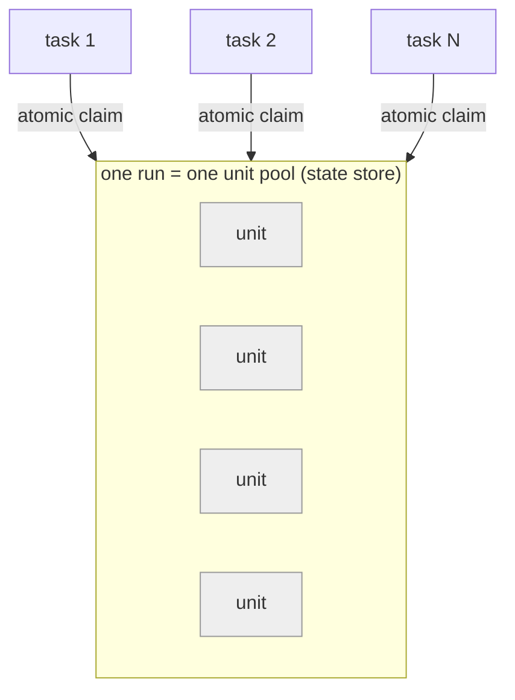

# Concurrency & coordination

This section *is* the **④ high-throughput** principle worked out. The design is
**pull-based and leaderless**: there is no broker and no coordinator process —
workers pull work from the [state store](../core/state.md), and the store's atomic
primitives are the only coordination. Because those primitives are backend-neutral
(the same claim/lease contract over SQLite / Firestore / DynamoDB), throughput is
**② provider-agnostic** too.

## The unit is the only granularity

A run is planned into **work units** — contiguous document index ranges. The unit
is simultaneously the granularity of **claiming**, **sharding** (one golden shard
per unit per table), the **manifest part**, and the **export read**. Size it
(`unit_size`) so there are comfortably more units than tasks — ideally 2–3× — or
some tasks finish with nothing to do.

## Two levels of concurrency

- **Across tasks** — N Cloud Run tasks run the same drain loop against one pool;
  the atomic claim guarantees no unit is worked twice.
- **Within a task** — a catalogue build makes **async LLM calls** concurrently
  (bounded by `--concurrency`); document *rendering* is sequential per task
  (Chromium), so within-task parallelism is the LLM path, not the render path.

## The coordination contract

- **Atomic claim.** *Advance this unit to RUNNING only if still PENDING* — one
  conditional write per backend (SQLite `BEGIN IMMEDIATE`, Firestore transaction,
  DynamoDB `ConditionExpression`). A lost race just moves to the next candidate.
- **Lease + reclaim.** A claim stamps a lease; an expired lease is reclaimable, so
  a crashed worker's unit returns to the pool. **SQLite** reclaims opportunistically
  inside the claim (a draining fleet self-heals with no resume); **Firestore /
  DynamoDB** reclaim explicitly (`reclaim_expired_units`) on resume and at the start
  of a catalogue build — a per-claim scan would be too costly at scale.
- **Planning race.** The run marker and its units are not one write, so `Run.planned`
  gates claiming: a worker that loses the conditional `create_run` either waits for
  the peer's plan to land or — if already planned (a re-run / retried task) — logs
  "already planned; resuming" and proceeds. This is what makes cold-starting N tasks
  safe.
- **Completion contract.** The **root manifest's presence = done.** It refuses to
  write over a gap, and a partial run leaves parts but no root, so a consumer never
  reads an incomplete run as complete. A worker exits non-zero only for **real
  holes** (failed units), never because peers are still finishing.

## Fleet budget

An LLM catalogue build under a fleet must not let N tasks each spend up to the cap.
`DistributedBudgetGuard` counts against the run's **spend rollup** in the state
store, so the budget holds **across** workers, not per process.

The [work-unit lifecycle](../core/state.md) and the per-backend claim internals are
on the State stores page; the end-to-end sequences are in
[Execution flows](flows.md).
