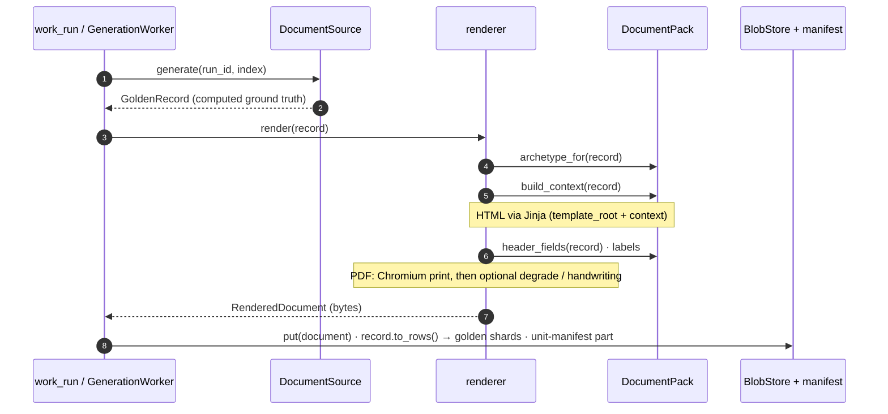

# Kernel ↔ pack contract

The contract between the kernel and a pack is small on purpose. A pack interface
designed against a single document type will be wrong somewhere, so the kernel
keeps **narrow expectations** and gives packs **wide latitude**: when a second
pack needs something, it is hoisted then — not before. Three pieces make up the
whole extension surface: `DocumentPack`, `GoldenRecord`, and `ContentCapability`.

!!! abstract "Principles"
    **⑤ Extensible** — this contract *is* the extension surface; a new pack is a
    new document type, no kernel fork. · **③ Locally capable** — a pack *declares*
    its `ContentMode` here. · **② Provider-agnostic** — a pack never names a
    provider; it states *what* content it needs.

## `DocumentPack`

A [`runtime_checkable` `Protocol`](https://docs.python.org/3/library/typing.html#typing.runtime_checkable)
(`core/pack.py`). A pack owns its record model, templates, label vocabulary, and
the record → render-context mapping; the kernel owns locale formatting, the Jinja
environment, storage, run state, providers, and export.

| Member | Kind | What it gives the kernel |
|---|---|---|
| `name` | attr | Stable id used in config (`document.pack: invoice`) and as the registry key. |
| `template_root` | property → `Path` | Directory of the pack's archetype templates. |
| `labels` | property → `LabelRegistry` | Printed vocabulary for every language the pack supports. |
| `content_capability` | property → `ContentCapability` | Where content comes from and whether it needs a key (below). |
| `table_names` | property → `tuple[str, …]` | The table names `to_rows()` will produce — declared up front so a sink can create/validate destinations before the first record. |
| `build_context(record)` | method → `dict` | Turns a record into a Jinja context. Must include `locale`, `currency`, `labels` — the kernel's formatting filters read those from the context. |
| `archetype_for(record)` | method → `str` | Template name (no extension) to render this record with. |
| `header_fields(record)` | method → `RunningHeader` | The per-page running header (`primary` text + localised `page_label`), so the PDF renderer needs no knowledge of any pack's record shape. |
| `default_source(*, selection, max_line_items, catalogue)` | method → `DocumentSource` | The pack's document source for a run (below). |

`default_source` is where three things meet: an optional **`catalogue`** artifact
URI to draw from (`file://` / `gs://` / `s3://`, credential-free to read); a
**`selection`** the pack must honour or refuse (a slice named `french` that emits
English is a wasted run — the pack raises `UnsupportedConstraint` rather than
silently ignoring); and the pack's decision of whether that source is key-free
(invoice returns a procedural sampler; a text-heavy pack returns an LLM-backed
source behind the same run loop).

## `GoldenRecord`

Every document type produces a **record** — the computed ground truth — and the
document is a *projection* of it (`core/record.py`). The surface is deliberately
tiny; packs carry whatever else they need.

```python
@runtime_checkable
class GoldenRecord(Protocol):
    record_id: str
    run_id: str
    locale: Locale
    def to_rows(self) -> TableRows: ...   # {"invoices": [...], "line_items": [...]}
```

`to_rows()` is what makes the **export path document-agnostic** — an invoice
yields `invoices` + `line_items`; a contract might yield `contracts` + `clauses`
+ `parties`, and the exporter never needs to know which. One rule: golden rows
correspond **1:1 with what appears on the page** (a tiered line prints a parent
row plus a row per band, so it contributes all of them), or per-row precision/
recall wouldn't be comparable between the golden set and an extractor's output.
Records are *computed, never extracted*: a record that fails to reconcile refuses
to exist rather than reach a PDF.

## `ContentCapability` — does this pack need a key?

The one thing that decides whether a document type generates on a laptop with no
cloud account is **where its prose comes from** (`core/content.py`). A pack
*declares* it:

```python
class ContentMode(StrEnum):
    PROCEDURAL = "procedural"   # built-in + computed; offline, deterministic, no key
    LLM_BACKED = "llm_backed"   # generated by an LLM in a one-time offline catalogue step

class ContentCapability:
    mode: ContentMode
    notes: str = ""
    requires_api_key -> bool    # True iff LLM_BACKED
    local_first      -> bool    # True iff PROCEDURAL
```

The kernel reads it through **`capability_of(pack)`**, which defaults to
`PROCEDURAL` for a pack written before this contract — the kernel keeps narrow
expectations. Infrastructure (storage, state, export) defaults to local for
either mode; only *content generation* differs.

An `LLM_BACKED` pack additionally implements **`LlmContentBuilder`**
(`catalogue_items()` → what to generate, `ingest(results)` → take the text back),
kept separate from `DocumentPack` so a procedural pack never stubs it out.
`build_catalogue(pack, mix, …)` drives that offline step (and raises for a
procedural pack). Invoice is `PROCEDURAL`, so an invoice run is local-first.

## How the kernel calls the pack during a run

The worker drives the pack through the source and the renderer — it never reaches
into pack internals:



`default_source(...)` supplies the `DocumentSource`; `render()` calls
`render_record(pack, record)` = `render_template(pack.template_root,
pack.archetype_for(record), pack.build_context(record))`, and the PDF path also
reads `pack.header_fields(record)` and `pack.labels`. Everything the kernel needs
of a document type flows through those hooks — which is exactly why a new pack is
a new document type and not a kernel change.

See [Execution flows](flows.md) for the full run/build/export sequences and
[Invoice pack → Overview](../invoice/overview.md) for this contract made concrete.
