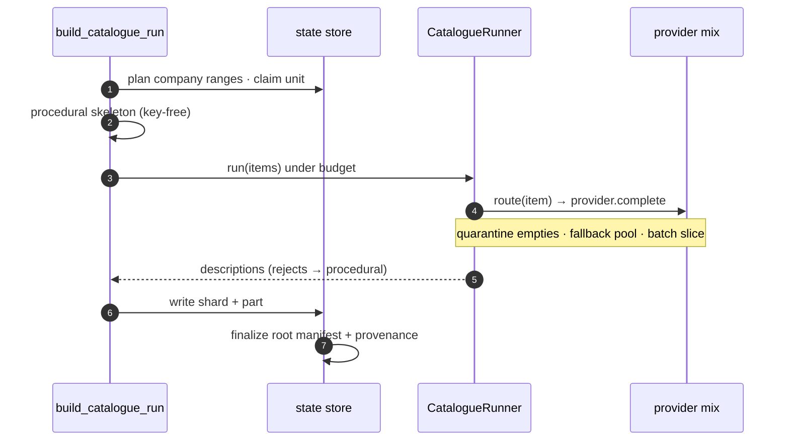
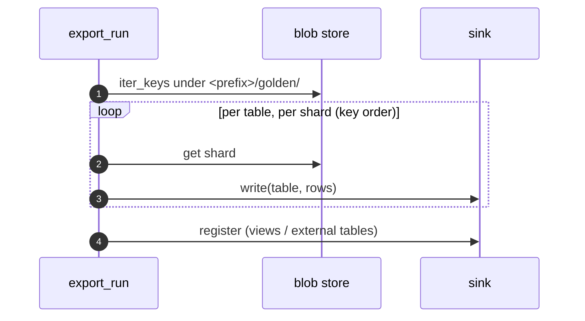

# Execution flows

Three lifecycles, all built on the same [claim/lease/manifest contract](concurrency.md).

## Run lifecycle

```mermaid
sequenceDiagram
    autonumber
    participant C as create_run
    participant S as state store
    participant W as worker(s)
    participant B as blob store
    C->>S: conditional create (plan units)
    Note over C,S: exactly one planner wins; others resume
    loop until pool empty
        W->>S: claim_next_unit (atomic, lease)
        W->>W: source.generate → render → degrade
        W->>B: put document · golden shards
        W->>B: write unit-manifest part
        W->>S: complete_unit
    end
    W->>S: all done? set COMPLETED
    W->>B: write root manifest (once)
```

`create_run` plans and records the run; workers drain the pool, each claiming a
unit atomically and — before marking it done — writing its manifest part; the
worker that flips the run to `COMPLETED` writes the **root manifest** exactly once.
Its presence is the completion signal.

## Catalogue build

A catalogue build *is a run* over company ranges, so it reuses the same claim/lease
machinery — with an LLM overlay inside each unit:



See [Invoice → Catalogue building](../invoice/catalogue.md) and
[Providers](../core/providers.md).

## Export



Export is a separate, re-runnable step over a completed run's shards — see
[Invoice → Export](../invoice/export.md).
