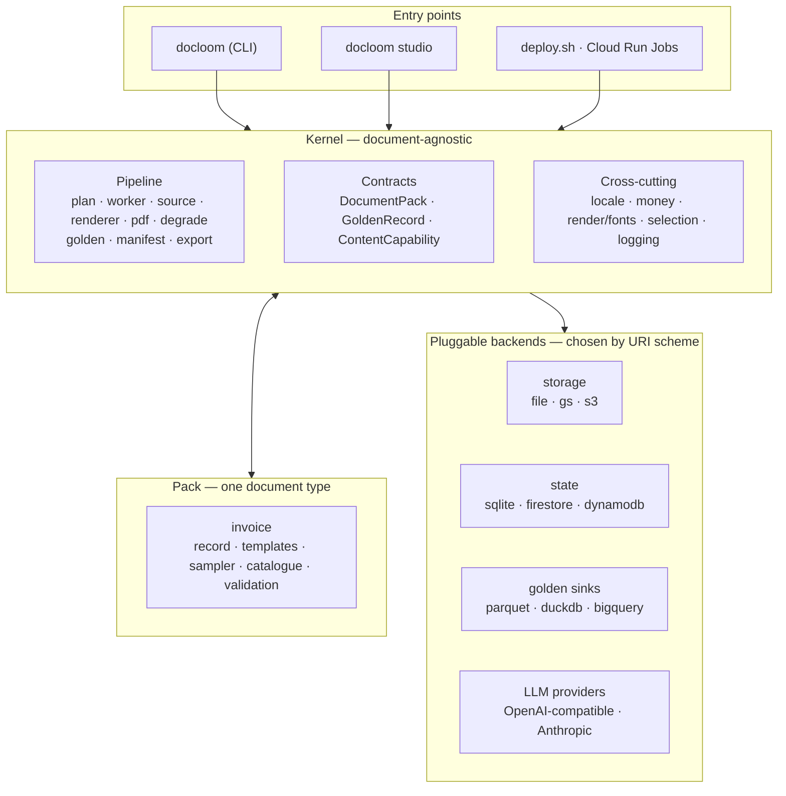

# Architecture — Overview

docloom has two parts and a hard line between them.

- A **document-agnostic kernel** does all the mechanical work: dividing a run into
  units, coordinating workers, formatting money and dates, running the Jinja/
  Chromium render, degrading captures, computing the golden set, writing the
  manifest, and exporting — none of which knows what an "invoice" is.
- A **pack** teaches the kernel how to produce **one document type**: its record
  model, its templates, its label vocabulary, and the mapping from a record to a
  render context. The first pack is `invoice`.

Everything docloom does is one of those two things collaborating across a small,
explicit contract ([Kernel ↔ pack contract](contract.md)). Testing the spine once
and adding document types as packs — not forks — is the whole point.

## The one-paragraph model

**Content is built once, offline, into a versioned artifact; generation then
draws from it locally with no API key.** For invoices the content is *procedural*
(companies, product lines, prices — all computed from a seed), so there is nothing
to pre-build and a run is fully offline. For a text-heavy type (contracts, whose
clauses are natural language) the content is generated by an LLM in a one-time
**catalogue** step and published as a read-only artifact; the document run itself
still makes **no LLM calls** — it reads the finished catalogue. That build-once-
then-generate-locally split is the shape of the entire system.

## The pieces

- **Entry points** all drive the same kernel. The `docloom` CLI is the primitive
  (`generate` / `export` / `catalogue` / `status` / …); `docloom studio` is the
  interactive/scriptable orchestrator over it and `deploy.sh`; `deploy.sh` runs it
  as Cloud Run Jobs. See [Studio](../studio/overview.md) and
  [Operations](../operations/deploy-tool.md).
- **Kernel** holds the pipeline, the two contracts, and the cross-cutting services
  (locale formatting, cent-exact money, the Jinja environment + bundled fonts,
  the `Selection` composition vocabulary, structured logging).
- **Pack** supplies the document type. It never names a backend or a provider — it
  says *what* content it needs and *how* a record renders.
- **Backends** are selected by URI scheme (`open_store` / `open_state` /
  `open_sink` / usage), so `file://` → `gs://`, `sqlite://` → `firestore://`,
  `duckdb://` → `bigquery://` are config changes, not code changes.

## How the principles show up here

The [five core principles](../index.md#core-principles) are visible in the shape
above:

- **⑤ Extensible** — the kernel/pack split *is* extensibility. A new document type
  is a new pack against the [contract](contract.md), no kernel fork; variants of a
  type live inside one pack.
- **③ Locally capable** — the build-once-then-generate-locally model *is* the
  local-first path. Whether content is key-free is a **pack** property
  (`ContentCapability`), declared through the contract, not a platform promise.
- **② Provider-agnostic** — the URI-scheme backends and the config-driven provider
  mix are the whole "swap by config, not code" story; nothing in the kernel or a
  pack hard-wires a model, a bucket, or a database.
- **④ High throughput** — one run is divided into **units** worked by N tasks that
  coordinate through the state store's atomic claim, with no broker or leader
  ([Concurrency & coordination](concurrency.md)).
- **① Realistic — but no PII** — realism comes from the pack (coherent product
  lines, cent-exact math, degrade/handwriting); PII-freedom is structural
  (identifying details derived at generation, never stored) plus a screen on
  generated text.

## Where to go next

- [Kernel ↔ pack contract](contract.md) — the exact extension surface.
- [Execution flows](flows.md) — run / catalogue-build / export sequences.
- [Concurrency & coordination](concurrency.md) — units, the atomic claim, leases.
- [Invoice pack → Overview](../invoice/overview.md) — the whole flow made concrete.
