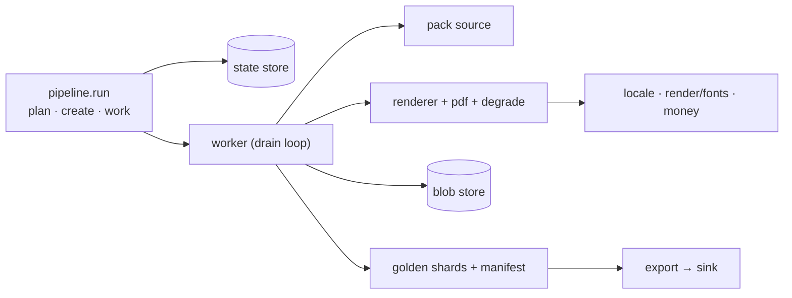

# Core reference — Overview

The kernel (`src/docloom/core/`) is everything that isn't a document type. It
divides into a **generation pipeline**, three sets of **pluggable backends**, the
**LLM providers**, and a layer of **cross-cutting services** the rest lean on.
Nothing here knows what an invoice is — packs supply that through the
[contract](../architecture/contract.md).

## The subsystems

| Area | What it is | Page |
|---|---|---|
| Pipeline (`core/pipeline/`) | Plan a run, drive workers, render, degrade, compute golden shards, write the manifest, export. | [Pipeline](pipeline.md) |
| State (`core/state/`) | The coordination store: runs, work units, the atomic claim, leases, the spend rollup, the quarantine set. | [State stores](state.md) |
| Storage / Sinks / Usage | Blob store for documents+shards; golden sinks for export; usage telemetry. | [Storage / Sinks / Usage](storage.md) |
| Providers (`core/providers/`) | LLM text providers, the weighted mix + fallback pool, the budget, the catalogue runner. | [Providers & LLM catalogue](providers.md) |
| Cross-cutting | Locale/labels/formatting, the Jinja render environment + fonts, cent-exact money, `Selection`, logging, the pack registry, kernel enums. | [Locale / render / money / logging](misc.md) |

The two contracts that bind packs to all of this — `DocumentPack`,
`GoldenRecord`, `ContentCapability` — live in `core/pack.py`, `core/record.py`,
`core/content.py` and are covered on the
[Kernel ↔ pack contract](../architecture/contract.md) page.

## How they compose in one run

`work_run` plans the run into units and records them in the **state store**; a
`GenerationWorker` claims units atomically, calls the pack's **source** for each
record and the **renderer** for the document, writes bytes to the **blob store**
and golden **shards**, and records a per-unit **manifest** part. **Export** later
streams those shards into a **sink**. The **cross-cutting** services (locale,
money, fonts) are read throughout.

- **② Provider-agnostic** is realised by the three URI-scheme backend groups plus
  the provider factory — every one is chosen by config, not code.
- **④ High throughput** is realised by the state store's atomic claim + leases,
  which let N workers drain one unit pool without a broker
  ([Concurrency](../architecture/concurrency.md)).

Read the pages above for each subsystem's protocol and adapters.
