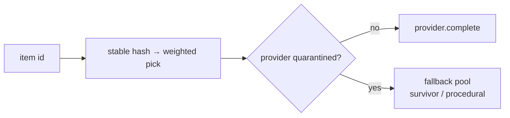

# Providers & LLM catalogue

`core/providers/` is the LLM layer used by the offline **catalogue** step (not by
document generation, which is key-free once a catalogue exists). It is entirely
config-driven — models, weights, and keys come from config and the environment,
never from calling code (**② provider-agnostic**).

| Module | Role |
|---|---|
| `base.py` | `TextProvider` protocol; `CompletionRequest` / `CompletionResult` / `Usage`. |
| `openai_compatible.py` | OpenAI-compatible chat (deepseek, dashscope); `extra_body` passthrough; per-call timeout. |
| `anthropic_provider.py` | Anthropic/Claude, including the batch API. |
| `factory.py` | `build_provider` / `build_mix` from a config block; presets; keys from env. |
| `mix.py` | `ProviderMix` — deterministic per-item routing + the fallback pool. |
| `budget.py` | `BudgetGuard`, `DistributedBudgetGuard`, `BudgetExceeded`. |
| `catalogue_runner.py` | `CatalogueRunner` — drives a mix over items under a budget; the circuit breaker. |
| `pricing.py` | Model pricing table; `pricing_for`. |

## Providers (`base.py`, and the two implementations)

A `TextProvider` turns a `CompletionRequest` into a `CompletionResult` (text +
`Usage` + exact cost). Two implementations ship: `OpenAICompatibleProvider`
(deepseek, dashscope, ollama — base URL + key from env, `extra_body` passed
straight through so a vendor param like `thinking: {type: disabled}` or
`enable_thinking: false` disables reasoning) and `AnthropicProvider` (incl.
`complete_batch` for the half-price Anthropic Batch API). An **empty completion is
treated as a failure**, not success — a reasoning model that spends its budget on
`reasoning_content` and returns `""` must not bake blanks into a catalogue.

## The provider mix (`mix.py`, `factory.py`)

`build_mix(config)` constructs a **weighted `ProviderMix`** from a `providers:`
block (name, model, weight, optional `extra_body`) plus an optional `fallback:`
list. `mix.route(item_seed, quarantined=…)` routes each item to a provider
**deterministically by a stable hash** of the item id — so the same item always
goes to the same model, and a build is reproducible. A provider in the
`quarantined` set (below) has its share redistributed by the fallback pool;
`procedural` is the free sink of last resort.

## Budget (`budget.py`)

`BudgetGuard.add(cost)` raises `BudgetExceeded` once cumulative real spend passes
the cap — per-call damage is always bounded. `DistributedBudgetGuard` counts
against the [state store's spend rollup](state.md) so a **fleet** of tasks shares
one budget rather than each spending up to the cap. The pre-flight estimate floors
itself with observed output, so a model that overruns `max_tokens` self-corrects
after one call.

## The catalogue runner (`catalogue_runner.py`)

`CatalogueRunner.run(items)` drives the mix over many items under the budget,
concurrently (async, bounded), and **batches** the batch-capable slice as one
request. It owns the **circuit breaker**: a provider that returns a streak of
empty completions (or errors) is **quarantined** — its in-flight calls cancelled
mid-round (`as_completed`, not `gather`, so a *hanging* provider can't burn the
task's wall clock), and its share routed through the fallback pool. The quarantine
set is persisted to the [state store](state.md) so later shards of a sharded build
skip it. Budget declines are excluded from the streak.

`build_catalogue(pack, mix, …)` (in `core/content.py`) is the entry point that
wires a pack's `catalogue_items()` through the runner and hands the results back
via `ingest()`. See [Invoice → Catalogue building](../invoice/catalogue.md) and,
for the studio's preset mixes + Secret Manager capture,
[Studio → LLM catalogue & secrets](../studio/catalogue.md).

!!! warning "Known limits (tracked in TODO.md)"
    The OpenAI-compatible provider hardening for reasoning models and a *separate*
    budget cap for empty completions are open follow-ups — the streak breaker
    quarantines a bad provider but doesn't cap the spend before it does.
