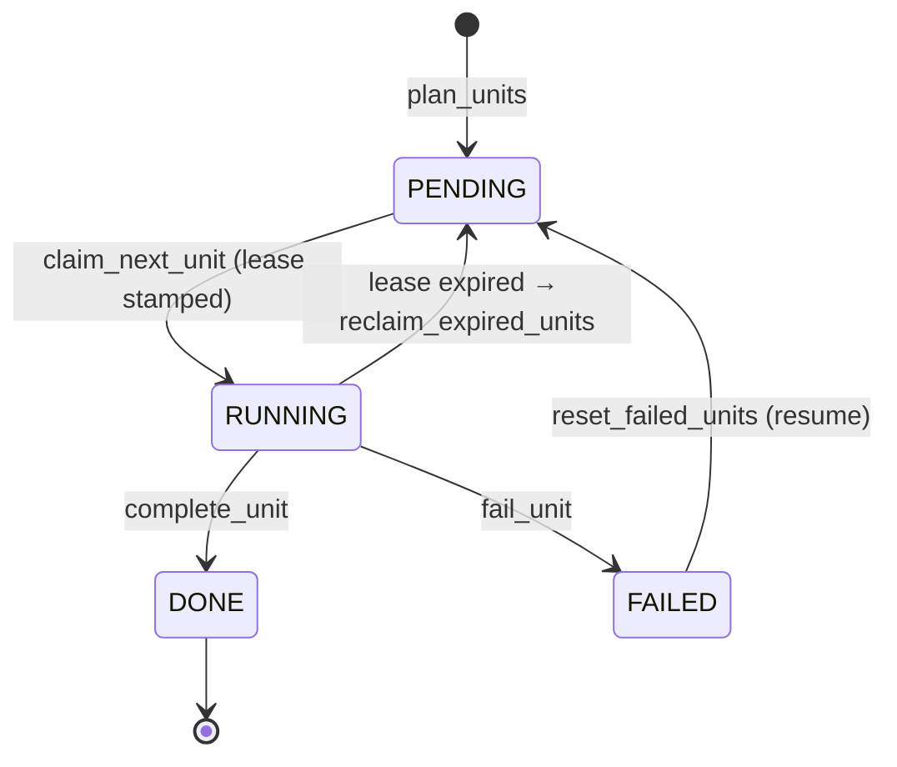

# State stores

The state store is docloom's **single coordination point**. It holds runs and
their work units, hands out units atomically, tracks leases so a crashed worker's
unit can be reclaimed, and carries the spend rollup and the provider quarantine
set. Coordination lives here — not in a broker, not in the compute layer — which
is what lets N workers drain one run with no leader (**④ High throughput**).

Chosen by URI (`open_state`): `sqlite://` (default, single box) · `firestore://`
· `dynamodb://`.

## The protocol (`core/state/base.py`)

`StateStore` is a `Protocol`; every backend implements the same surface.

| Method | Purpose |
|---|---|
| `create_run(run, units) -> bool` | Conditional write — returns whether *this* caller planned the run (the rest wait). |
| `get_run` / `set_run_state` | Read the `Run`; move it PENDING/RUNNING/PAUSED/CANCELLED/COMPLETED/FAILED. |
| `claim_next_unit(run_id) -> WorkUnit \| None` | The **atomic claim** — hand exactly one pending unit to one worker, stamping a lease. |
| `complete_unit` / `fail_unit` | Mark a claimed unit DONE, or FAILED with an error. |
| `reset_failed_units` / `reclaim_expired_units` | Return failed units, or units with a lapsed lease, to the pool (resume / self-heal). |
| `units` / `progress` | Iterate units; counts by `WorkUnitState`. |
| `add_spend` / `spend` / `total_spend` | The per-(run, model) spend rollup, exact via integer nano-dollars. |
| `quarantine_providers` / `quarantined_providers` | The set of providers a build has quarantined for empty output. |
| `close` | Release resources. |

`Run` and `WorkUnit` are the two records. A unit is an **index range**
(`start_index … end_index`) — the single granularity of claiming, sharding, and
export. A unit carries a `lease_expires_at`; `lease_is_expired(now)` is what makes
reclaim possible.

## The atomic claim

The claim is one conditional write — *advance this unit to RUNNING only if it is
still PENDING* — implemented natively per backend:

- **SQLite** — `BEGIN IMMEDIATE`; also reclaims expired leases opportunistically
  inside the claim's write lock, so a draining fleet self-heals without a resume.
- **Firestore** — a transaction; reclaim is explicit (`reclaim_expired_units`), run
  on resume — a per-claim scan would be too costly at scale.
- **DynamoDB** — a conditional `UpdateItem` (`attribute condition state = pending`).

A worker that loses the race simply advances to the next candidate. This is the
same primitive used for **run creation** (`ON CONFLICT DO NOTHING` /
`document.create()` / `attribute_not_exists(pk)`), so cold-starting N tasks
produces exactly one planner and the losers wait.

## Lease + reclaim

Each claim stamps a lease (default 15 min, configurable per store) and clears it
on complete/fail/reset. `reclaim_expired_units` returns `RUNNING` units whose lease
lapsed to the pool — so a worker that crashed mid-unit doesn't strand its work.
Reclaim runs on `resume_run` and at the start of a catalogue build.

## Work-unit lifecycle

The run reaches `COMPLETED` only when no unit is PENDING/RUNNING/FAILED — and that
transition is what writes the [root manifest](../core/pipeline.md).

## Spend & quarantine

`add_spend` increments a `(run, model)` row and a `(run, "*")` total in **integer
nano-dollars**, so the counter is exact and a fleet-wide budget
([`DistributedBudgetGuard`](providers.md)) can hold across N workers rather than
per process. The quarantine set records providers a catalogue build found to
return only empty completions, so later shards route around them.

Backends are verified against real emulators (SQLite in-process, the Firestore
emulator, DynamoDB Local / moto). See
[Concurrency & coordination](../architecture/concurrency.md) for the design.
