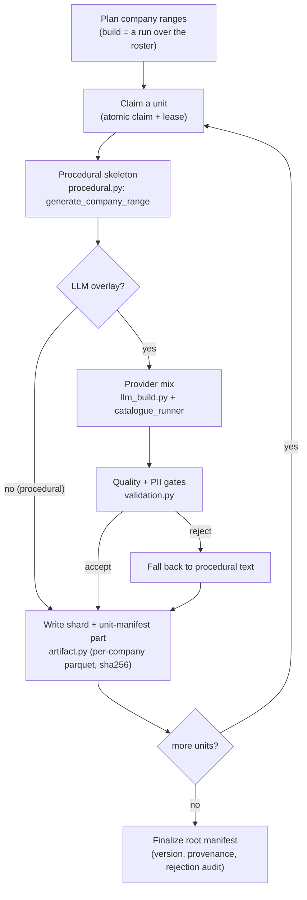

# Catalogue building

A **catalogue** is the invoice pack's content artifact — the roster of companies
and, for each, the product line it sells. It is built **once, offline**, published
as a versioned artifact, and then read (credential-free) by every run. Building it
is optional: the procedural pool ships in the pack, so a run is fully local
without ever building one; you build a catalogue when you want the LLM-written
descriptions or a larger, more varied pool.

!!! abstract "Principles"
    **③ Locally capable** — the procedural build is key-free and deterministic. ·
    **④ High throughput** — a large build is a **sharded run** over company ranges.
    · **① Realistic — but no PII** — the LLM overlay adds natural descriptions;
    `validation.py` screens them; `derive_identity` keeps PII out of the artifact.

## The flow

## What each stage is

- **Plan / claim (`build_run.py`).** A catalogue build is *a run over company
  ranges* — it uses the same [state store, atomic claim, and lease](../architecture/concurrency.md)
  as document generation (`build_catalogue_run`). Single-task in-memory by default;
  set `catalogue.tasks > 1` to shard it across N Cloud Run tasks, resumable.
- **Procedural skeleton (`procedural.py`).** A key-free combinatorial pool
  (~7,900 base descriptions) produces each company and its products deterministically
  per index (`generate_company` / `generate_company_range`). This is always the
  baseline — and the fallback for anything the LLM can't fill.
- **LLM overlay (`llm_build.py` + `core/providers`).** When a provider mix is
  configured, an LLM rewrites descriptions (and co-generates a price band) in
  chunks. Routing, batching, the empty-completion **circuit breaker**, the
  **fallback pool**, and the **budget** are the kernel's `CatalogueRunner` /
  `ProviderMix` / `BudgetGuard` — see [Providers & LLM catalogue](../core/providers.md).
  Any slot the LLM can't fill (failed call, rejected text, bad band) keeps its
  procedural product, so a build is always complete and a provider outage degrades
  to procedural.
- **Quality + PII gates (`validation.py`).** Every generated description is screened
  before it is written: emails, URLs, long digit runs, honorific+name, entity
  suffixes (PII), plus quality rules (empty, assistant preamble, markdown,
  marketing prose) and cross-item dedup. A flagged description is rejected and
  falls back to procedural text; too high a rejection rate fails the build. The
  results are recorded in the manifest as an audit.
- **Artifact (`artifact.py`).** Per-company Parquet, decimal128 money, **sha256 per
  shard**, sharded read/write, and a root **manifest** carrying the
  `catalogue_version` (stamped on every golden row a run produces), `created_at`,
  and the build `provenance`. Identity is **not stored** — it is derived from
  `company_id` via `derive_identity` at generation time.

## Driving it

- CLI: `docloom catalogue --out … --version … [--providers <file>] [--budget-usd N] [--concurrency N] [--state <uri> --tasks …]`.
- Studio: the **catalog** step, with provider-mix presets and Secret Manager name
  capture — see [Studio → LLM catalogue & secrets](../studio/catalogue.md).
- Cloud: `deploy.sh catalogue` — see [Operations](../operations/deploy-tool.md).
