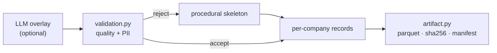

# Content: catalogue, procedural, LLM, artifact

"Content" is everything a run needs to invent an invoice that isn't computed on the
spot: the roster of companies, and for each the product line it sells. It comes in
layers — a procedural baseline, an optional LLM overlay, published as an artifact —
all sitting behind the [catalogue](catalogue.md).

## The catalogue model (`catalog.py`)

`Catalogue` / `CompanyRoster` / `Company` / `ProductTemplate` are the shape:
a company (with its business type, jurisdiction, product category and niche) and
the products it can bill. `SeedCatalogue` is the built-in one shipped in the pack,
so a run works with **no build at all**.

**Identity is derived, not stored.** A company's address, phones, emails, and tax
registrations come from `derive_identity(company_id)` at generation — deterministic
and format-valid, but **never written to the artifact** (**① no PII**).

## Procedural (`procedural.py`)

The key-free baseline: a combinatorial pool (~7,900 base descriptions) expands into
each company and its products deterministically per index
(`generate_company` / `generate_company_range`). This is always present — the
skeleton the LLM overlays, and the **fallback** for anything the LLM can't fill.

## LLM overlay (`llm_build.py`)

When a [provider mix](../core/providers.md) is configured, an LLM rewrites product
descriptions (and co-generates a price band) in chunks — the semantic long tail a
combinatorial pool can't reach. Structural fields, the roster, and the fallback stay
procedural: any slot the LLM can't fill keeps its procedural product, so a build is
**always complete**. The price band is a *sampling input*, never a golden number — a
bad one is dropped for the procedural band.

## Validation (`validation.py`)

Every generated description is screened before it is written — **quality** (empty,
assistant preamble, markdown, marketing prose, too long/short) and **PII** (emails,
URLs, long digit runs, honorific+name, entity suffixes), plus cross-item dedup. A
flagged description is **rejected and falls back to procedural text**; too high a
rejection rate fails the build. The same gates run over procedural content (that is
how they're tested without a key), and the results are recorded in the manifest as
an audit.

## Artifact (`artifact.py`)

The published form: **per-company Parquet**, decimal128 money, sharded read/write,
a **sha256 per shard**, and a root **manifest** carrying the `catalogue_version`
(stamped on every golden row a run produces), `created_at`, and the build
**provenance** (models, fill rate, cost, rounds). Reading it needs no credential
(`file://` / `gs://` / `s3://`), so a pack with a rich catalogue is as local-first
as one without.

See [Catalogue building](catalogue.md) for the *build* flow (a sharded run under a
budget) and [Providers](../core/providers.md) for the mix mechanics.
