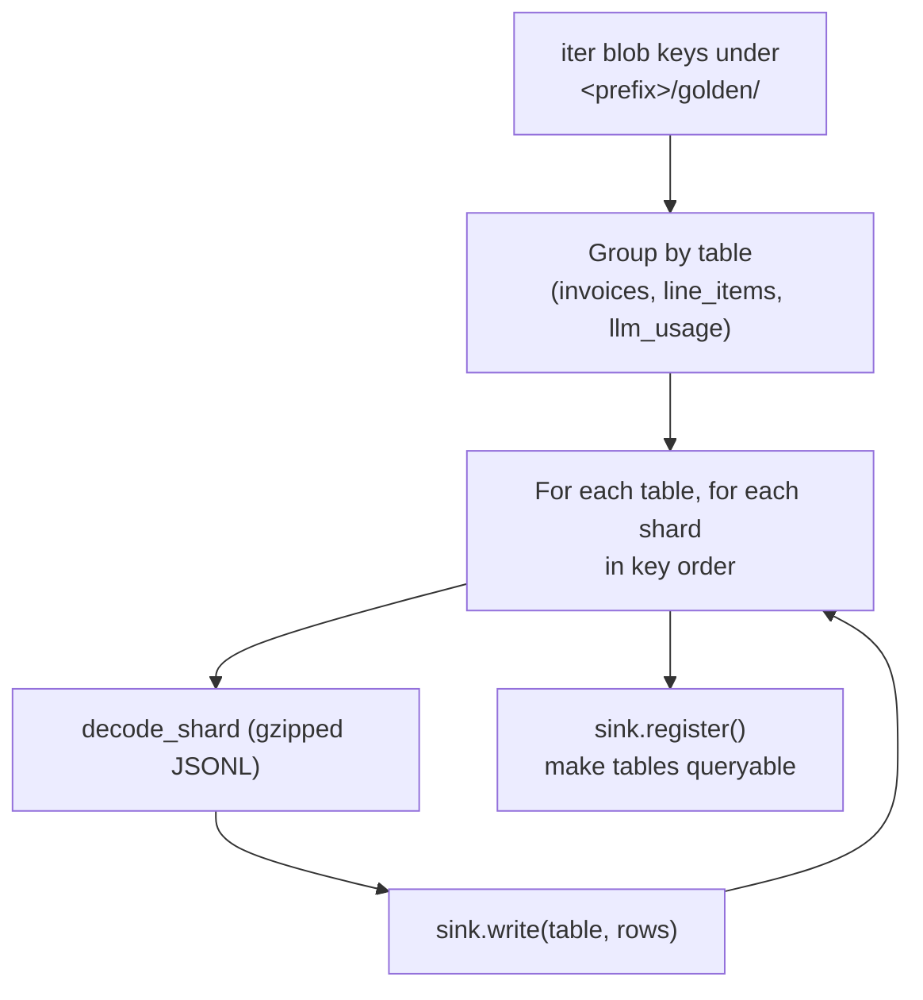

# Export

Export takes a completed run's **golden shards** and loads them into a queryable
sink. It is document-agnostic — it reads the tables `to_rows()` produced and never
needs to know they are invoices — and it is a separate, re-runnable step (the run
already wrote the ground truth; export just makes it queryable).

## The flow

## What it does

- **Discover shards (`core/pipeline/export.py` → `export_run`).** Lists blob keys
  under `<storage_prefix or run_id>/golden/` and groups them by table name. So a
  run under a nested prefix (`runs/<run>/<slice>/…`) exports by pointing
  `--storage-prefix` at it.
- **Stream in key order.** For each table, each shard (sorted) is decoded and
  written to the sink. The order is deliberate — a table's Parquet parts land
  **deterministically**. It is a single sequential reader today (a large export is
  single-threaded I/O; parallel prefetch is a tracked follow-up).
- **Register.** `sink.register()` runs once at the end to make the tables queryable
  — create DuckDB views / BigQuery external tables; a no-op for plain Parquet.
- **Usage tables ride along.** `export_run` discovers tables by prefix, so the
  `llm_usage` telemetry (if a build recorded any) exports with no export change.

## Sinks (`core/sinks/`, URI-scheme selected)

Chosen by `--sink` URI — the export code is identical across them (**②
provider-agnostic**):

| Scheme | Sink |
|---|---|
| `parquet://…` | Plain Parquet parts on disk / object store. |
| `duckdb://…` | Parquet parts + a DuckDB database with views over them. |
| `bigquery://<project>/<dataset>` | Parquet in GCS + BigQuery external tables. |

## Driving it

- CLI: `docloom export --run-id … --sink <uri> [--storage <uri>] [--storage-prefix …]`.
- Studio: the **export** step (default sink `bigquery://<project>/golden` on gcp,
  a local DuckDB on `local`).
- Cloud: `deploy.sh export`.

See [Storage / Sinks / Usage](../core/storage.md) for the sink protocol and
[the golden dataset](../architecture/data-model.md) for what the rows mean.
