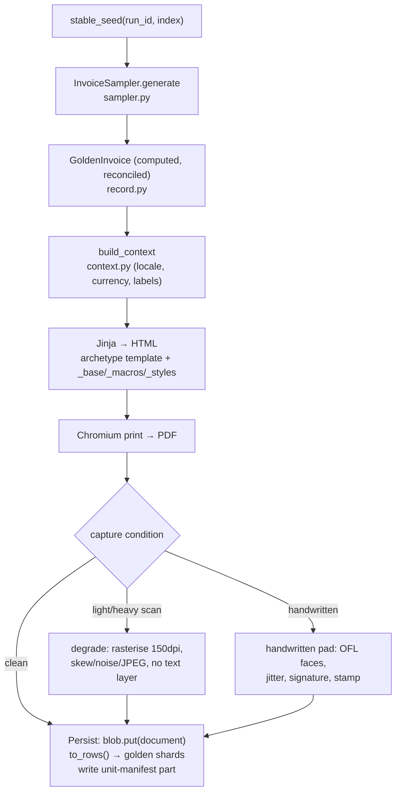

# Invoice generation

Generation is the run: for each document index in a work unit, the pack invents a
`GoldenInvoice`, the kernel renders it, and the document plus its golden rows are
persisted. It is deterministic (a run id + an index seed the whole invoice) and
makes **no LLM calls** — it reads a finished catalogue, if any.

!!! abstract "Principles"
    **① Realistic — but no PII.** Realism is the sampler's job — coherent product
    lines, cent-exact figures, per-jurisdiction tax/labels, and scanned/handwritten
    captures. PII-freedom is structural: identifying details are **derived at
    generation and never stored**, so there is no PII field to leak.

## The flow

## What each stage is

- **Seed (`core/pipeline/source.stable_seed`).** `run_id` + the document index seed
  every draw, so the same index always yields the same invoice — the property that
  makes a run resumable and a golden set reproducible.
- **Sample (`sampler.py` → `InvoiceSampler`).** The pack's `DocumentSource`. It
  draws an issuer from the roster (respecting the run's [`Selection`](composition.md)),
  picks a business type / billing model / template, invents line items from the
  catalogue's product line, and computes tiers, discounts, tax buckets, and totals
  — cent-exact. It returns a `GoldenInvoice` (`record.py`: `Party`, `LineItem`,
  `PricingTier`, `TaxBucket`, `InvoiceTotals`, `RenderProfile`).
- **Reconcile.** A record that doesn't balance **refuses to exist** — the failure
  surfaces here, not as a wrong number on a PDF.
- **Context (`context.py`).** `build_context` maps the record to a Jinja context
  carrying `locale`, `currency`, and `labels` so templates never pass them
  explicitly. Jurisdiction (`jurisdictions.py`) decides the tax model, currency,
  and mandatory issuer fields; `labels.py` supplies per-locale printed strings.
- **Render.** The kernel's Jinja environment renders
  `archetype_for(record)` (one of 7 archetypes) over `_base` / `_macros` /
  `_styles`; Chromium prints it to PDF; the running header comes from
  `header_fields(record)`. Brand marks and seals are procedural and key-free
  (`logos.py`, `stamps.py`).
- **Capture condition.** `RenderProfile` selects the finish. **Clean** keeps the
  text layer intact (no cost). **Light/heavy scan** rasterises at 150 dpi and
  degrades (skew, blur, noise, JPEG artefacts) with the record's own seed, re-wrapped
  with **no text layer** so OCR must read pixels. **Handwritten** renders a ruled
  pad with values in bundled OFL handwriting faces, per-field jitter, a signature,
  and a company stamp (`handwriting.py`). Wear (crisp ↔ worn) scales the ink and
  degradation together. Golden rows are identical across conditions.
- **Persist (`core/pipeline/worker.py`).** The document bytes go to the blob store;
  `record.to_rows()` becomes gzipped-JSONL **golden shards**; a **unit-manifest
  part** (documents + shards, each with a sha256) is written *before* the unit is
  marked done. See the [pipeline](../core/pipeline.md) and
  [concurrency](../architecture/concurrency.md) pages for the claim/lease/manifest
  machinery.

## Driving it

- CLI: `docsynth generate --run-id … --total N [--catalogue <uri>] [--format pdf|html] [composition flags]`.
- Studio: the **pdfs** step; a cloud run is [dispatched detached](../studio/dispatch.md).
- Cloud: `deploy.sh deploy && deploy.sh run` (or `dispatch`).
