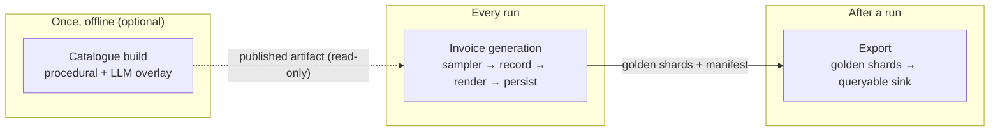

# Invoice pack — Overview

`invoice` is docsynth's first pack (`packs/invoice/`). It implements the
[kernel contract](../architecture/contract.md) — `InvoicePack` is a
`DocumentPack`, `GoldenInvoice` is a `GoldenRecord`, and it declares
`ContentMode.PROCEDURAL`, so an invoice run is **local-first and key-free**.

There are three flows, and they run at different times:

- **[Catalogue building](catalogue.md)** is the one-time, offline content step. A
  procedural catalogue is free and key-less; an LLM overlay optionally writes
  richer descriptions. It publishes a **versioned artifact** that generation reads.
  A run needs it only if you want the LLM-written descriptions — the procedural
  seed catalogue ships in the pack.
- **[Invoice generation](generation.md)** is the run: for each index, the sampler
  invents a `GoldenInvoice` deterministically, the kernel renders it to PDF/HTML
  (optionally degraded or handwritten), and the document + its golden rows are
  persisted with a per-unit manifest.
- **[Export](export.md)** reads a completed run's golden shards and loads them
  into a queryable sink (Parquet / DuckDB / BigQuery).

## The record is the ground truth

Every invoice is a *projection* of a computed `GoldenInvoice` (`record.py`:
`Party`, `LineItem`, `PricingTier`, `TaxBucket`, `InvoiceTotals`,
`RenderProfile`). The figures are cent-exact and reconciled **before** anything
renders — a record that doesn't balance refuses to exist rather than reach a PDF.
`GoldenInvoice.to_rows()` flattens to `invoices` + `line_items`, one row per
*printed* row, which is what the [export](export.md) and the golden dataset are
built from.

!!! abstract "Principles"
    **① Realistic — but no PII** is *most* visible in this pack: the merchant
    sub-category + niche layer keeps a company's catalogue one coherent product
    line, the LLM overlay writes natural descriptions, cent-exact math and
    per-jurisdiction tax models make the figures plausible, and `derive_identity`
    keeps addresses/phones/tax-IDs **out of the artifact** (derived at generation,
    never stored). · **③ Locally capable** — procedural catalogue + a read-only
    run. · **④ High throughput** — the catalogue build is itself a
    [sharded run](catalogue.md).

## Component map (`packs/invoice/`)

| Area | Modules |
|---|---|
| Contract | `__init__.py` (`InvoicePack`), `record.py` (`GoldenInvoice`), `context.py` |
| Generation | `sampler.py` (`InvoiceSampler`), `enums.py`, `jurisdictions.py`, `composition.py` |
| Content | `catalog.py` (`derive_identity`, `SeedCatalogue`), `procedural.py`, `llm_build.py`, `build_run.py`, `artifact.py`, `validation.py` |
| Rendering | `templates/` (`_base`/`_macros`/`_styles` + 7 archetypes), `labels.py`, `handwriting.py`, `logos.py`, `stamps.py` |

The full [Reference](reference.md) lists every component; the three flow pages give
the detailed diagrams.
