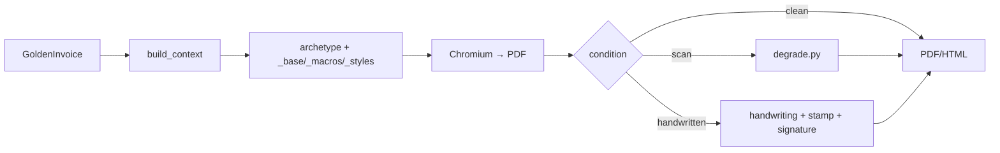

# Rendering

Rendering turns a computed `GoldenInvoice` into the artefact an extractor sees. It
must **look real** — a pristine, identical-looking corpus tests nothing (**①
realistic**) — so the pack carries visual variety (7 archetypes), physical realism
(scan degradation, handwriting), and brand marks, all while the golden rows stay
identical across every finish.

## Templates & archetypes (`templates/`)

Jinja templates, rendered by the kernel's [environment](../core/misc.md) then
printed to PDF by Chromium. A shared `_base.html.j2`, `_macros.j2`, and
`_styles.css.j2` back **7 archetypes** — genuinely different layouts, not restyles:

`banner-header-06` · `boxed-form-01` · `fullbleed-05` · `handwritten-form-01` ·
`meta-sidebar-01` · `receipt-compact-01` · `telecom-itemized-37`.

`archetype_for(record)` picks one. `telecom-itemized-37` is the long, multi-page
itemised layout (hundreds of line items); `handwritten-form-01` is the pre-printed
pad the handwritten condition always uses. Labels come from `labels.py` (per-locale
printed strings); the running header is composed by the pack. Page-fit (`fit_scale`)
avoids a near-empty trailing page, and `(cont'd)` markers repeat on page-spanning
sections.

## Capture conditions

The `RenderProfile` on the record selects the finish; golden rows are unchanged
across all of them.

- **Clean** — the printed PDF, text layer intact (no cost).
- **Scan** (`degrade.py`) — rasterise at 150 dpi, apply skew / blur / gaussian noise
  / dust speckle / JPEG artefacts / desaturation (heavy scan), and re-wrap as an
  **image-only PDF with no text layer**, so OCR must read pixels. Seeded per record.
- **Handwritten** (`handwriting.py`) — a ruled pad with every value written in one of
  four bundled OFL handwriting faces with per-field jitter, signed in a script face,
  and stamped. Face choice is a legibility dial for HTR difficulty.

**`wear`** (crisp ↔ worn, 0..1) drives the ink roughening *and* the scan degradation
**together**, so crisp and worn are ends of one dial rather than two code paths.
Neither end reaches zero — a crisp document is still a capture of paper.

## Brand marks (`logos.py`, `stamps.py`)

Both **procedural and key-free**: `logos.py` draws a per-company brand mark and
watermark; `stamps.py` draws a company seal (circular/oval/rectangular, desaturated
pad ink, roughened) keyed to the company so one office keeps one stamp across its
invoices. On handwritten and goods-receipt layouts a signature and, for receipts, a
separate **received-by** block (a different hand) are drawn in.

## The render step in context

Fonts are the kernel's — bundled OFL faces embedded as data-URIs for
**byte-identical typography on any host** ([render/fonts](../core/misc.md)). See
[Invoice generation](generation.md) for the full run flow.
