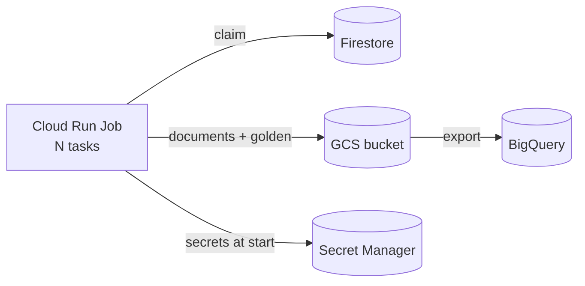

# Deploying on GCP

The reference cloud stack is **Cloud Run Jobs** + **GCS** + **Firestore** +
(optionally) **BigQuery**, stood up and driven by [`deploy.sh`](deploy-tool.md).
Nothing here is *required* — the same config runs on local backends first (**③
locally capable**) — but it is the proven production path.

## What `provision` creates

`deploy.sh provision` (idempotent) sets up:

- **APIs** — Cloud Run, Firestore, Storage, Artifact Registry, Secret Manager.
- **GCS bucket** — documents, golden shards, and catalogues (`gs://<bucket>/runs/…`,
  `gs://<bucket>/catalogues/…`).
- **Firestore (Native)** + the **composite index for the claim query** (`state`
  ASC, `unit_index` ASC on `work_units`) — the atomic claim needs it; index build
  takes a couple of minutes.
- **Service account** (`docsynth-run`) + IAM (run.invoker, datastore.user, storage).

`build` then builds the container (Playwright/Chromium version-pinned,
`PYTHONUNBUFFERED=1`) via Cloud Build and pushes it to Artifact Registry.

## Cloud Run Jobs, not a Service

Generation runs as **Jobs** (batch), not a Service. One `execute` per document
**slice**; `job.tasks` parallelize a slice's units, coordinated by the
[Firestore claim](../architecture/concurrency.md). A catalogue build deploys its
own job shape — single-task in-memory by default, or sharded multi-task when
`catalogue.tasks > 1`.

## Secrets

API keys for the LLM catalogue live **only in Secret Manager** — never in the
image, the config, command args, the repo, or logs (**① no-PII/no-secret-leak**).
`deploy.sh catalogue` verifies each configured secret exists, grants the service
account access, and injects it at task start. The config carries only the secret
**names** (`catalogue.secrets: {ENV_NAME: secret-name}`); the [studio](../studio/catalogue.md)
captures those names to its registry and prints the `gcloud secrets create` lines
for any missing — it never handles a key value.

## The pieces at run time

Follow a run with [Running / resuming / status / export](running.md). The
[studio](../studio/overview.md) drives all of this — including onboarding an
existing project and detached dispatch — over the same `deploy.sh`.
