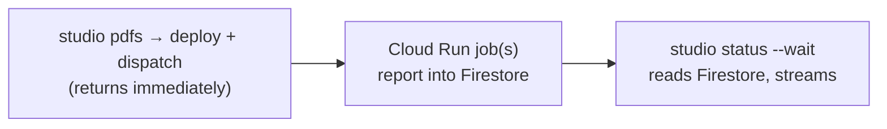

# Dispatch & status

A GCP run can take hours and **outlive the terminal** that launched it, so the
studio does not block on it. It **dispatches** the run and returns handles + links
immediately; you reattach later with `studio status`.

## Dispatch

On the `pdfs` step against `gcp`, the studio runs `deploy.sh deploy` (quick) then
[`deploy.sh dispatch`](../operations/deploy-tool.md) — execute **without `--wait`**,
returning as soon as the Cloud Run executions are created. It prints the run's
links and how to reattach:

```
✔ dispatched 5000 invoice → gs://…/runs/corpus1
  dispatched — not waiting. Reattach with:
    docsynth studio status -p gcp --project corpus1 --run corpus1
```

(A `local` run is synchronous — nothing to detach.)

## `studio status` — reattach

```bash
docsynth studio status --project <ref> --run <run-id> [--wait]
```

It resolves the run's **state store** from the saved project (`firestore://…` for
gcp, the sqlite path for local) and reads progress with `docsynth status` — so it
works **from any machine that has the project registered**, with no live job or
terminal to hold. `--wait` streams until the run reaches a terminal state (exits
non-zero if the run drained with failed units).



Because status just reads the state store, it is cheap to poll and needs no
running job — the reader half of detached dispatch. Underneath, `docsynth status
--wait` polls the [state store](../core/state.md) and prints on change; the studio
resolves which store from the project registry.
