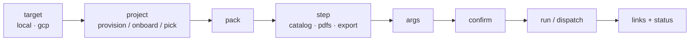

# Studio — Overview

`docsynth studio` is the interactive/scriptable orchestrator over the same kernel
and [`deploy.sh`](../operations/deploy-tool.md). In a terminal it is a wizard; with
flags it is non-interactive (CI). It is the primary way an operator drives docsynth
end to end — pick where to run, provision or reuse a project, and run the three
steps — without hand-writing a `run.yaml`.

`docsynth` with no subcommand launches it; `docsynth studio` does too.

## The wizard flow

Each stage is prefilled by any flag already supplied and only prompts for what is
missing, so the identical walk serves a fully-flagged run and a bare interactive
one. Prompts are arrow-key selects (an optional `questionary`/`InquirerPy` dep,
with a Rich/Typer fallback), with **back / exit** navigation and a spinner; the
first screen is the [target](#targets). A cloud run is **dispatched** and returns
handles + links immediately — you follow it with [`studio status`](dispatch.md).

## Targets

The studio runs against a `DeploymentTarget`. Two ship:

| Target | `provision` | steps run on | content |
|---|---|---|---|
| `local` | make a workspace dir (`blobs/`, `runs.db`) | this machine, synchronously | `file://` / `sqlite://` / `duckdb://` |
| `gcp` | shells `deploy.sh provision + build` | Cloud Run Jobs | `gs://` / `firestore://` / `bigquery://` |

The **`gcp`** target synthesizes the exact `run.yaml` that
[`deploy.sh`](../operations/deploy-tool.md) understands and shells into it, so a
run is identical whether launched from the studio or by hand — one source of truth
for the GCP wiring. `aws` / `azure` are named for a clear "not yet" message.

`DeploymentTarget` is a small protocol (`normalise` / `provision` / `adopt` /
`run_catalogue` / `run_generate` / `run_export` / `teardown` / `catalogue_info` /
`scaffold`); a `dry_run` on any step resolves the command without executing, which
is how the whole surface is testable without a cloud account.

## The pieces

- **[Projects & provisioning](projects.md)** — the registry, provision/onboard, and
  the `projects` / `provision` / `teardown` subcommands.
- **[Steps](steps.md)** — catalog / pdfs / export and their args.
- **[Dispatch & status](dispatch.md)** — detached cloud runs and reattach.
- **[LLM catalogue & secrets](catalogue.md)** — provider-mix presets, budget,
  Secret Manager name capture, and catalogue re-use.
- **[Tuning & scaffolding](tuning.md)** — `--concurrency` / `--tasks`, re-use,
  `--scaffold`.

The full design is in `feature_explorations/interactive-cli-studio.md`.
